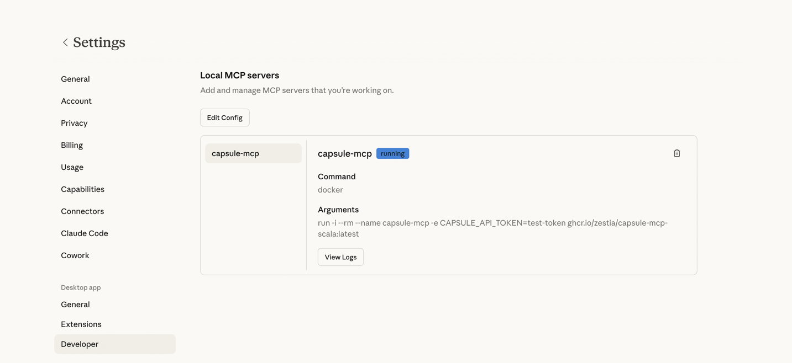

# Capsule MCP Server

MCP server that connects to your Capsule CRM data.

## Setup
You can get started with the server and use it with your favourite AI assistant.

### Prerequisites

You will need an AI assistant that supports **local** MCP servers. Some popular options:

- **[Claude Desktop](https://claude.com/download)** - Anthropic's desktop app
- **[Cursor](https://www.cursor.com/)** - AI code editor

### Install Docker
The Capsule MCP Server runs inside [Docker](https://www.docker.com/). Follow the instructions below for your operating system.

@@@ note
Already have Docker installed? Skip ahead to [Configuration](#configuration).
@@@

**Option 1: Docker Desktop (recommended for most users)**

1. Go to [https://www.docker.com/products/docker-desktop](https://www.docker.com/products/docker-desktop/)
2. Click **Download Docker Desktop**, selecting your OS
3. Run the installer and follow the prompts
4. Restart your computer when prompted
5. Launch Docker Desktop

**Option 2: CLI only (for developers)**

Follow the [official installation guide](https://docs.docker.com/engine/install/) for your specific distribution.

### Verify your installation

Once Docker is installed (via any method above) **and running**, confirm it is working by opening a terminal/console and running:

```
docker --version
```

The above should print a version number.

### Configuration
Configure your favourite AI assistant to connect to the Capsule MCP Server.

#### 1. Generate an API key
Generate an API key in your Capsule CRM account.

In your Capsule account, navigate to: `My Preferences → API Authentication Tokens → Generate New API Token`

   - **Description:** Capsule MCP Server
   - **Scope of this token:** Select `Read information from your Capsule account` only

Copy the generated token and temporarily save it somewhere safe.

#### 2. Locate your AI assistant config file
Locate the config file for your chosen AI assistant:

- **Claude Desktop**
    - MacOS: `~/Library/Application Support/Claude/claude_desktop_config.json`
    - Windows: `%APPDATA%/Claude/claude_desktop_config.json`
- **Cursor** - [configuration locations](https://cursor.com/docs/context/mcp#configuration-locations)

Add the following to the config file, replacing `YOUR-API-TOKEN` with your Capsule API token and save.

```json
{
  "mcpServers": {
    "capsule-mcp": {
      "command": "docker",
      "args": [
        "run",
        "-i",
        "--rm",
        "--name",
        "capsule-mcp",
        "-e",
        "CAPSULE_API_TOKEN=YOUR-API-TOKEN",
        "ghcr.io/zestia/capsule-mcp-scala:latest"
      ]
    }
  }
}
```

#### 3. Test the connection
Restart your AI assistant. Depending on your AI assistant, you should now see a new `capsule-mcp` server running in the
list of available MCP servers in settings.

For example, in Claude Desktop:


Try asking a basic question about your Capsule account to test the connection, for example: `How many contacts do I have in Capsule?`

@@@ index
* [Available Tools](available-tools.md)
* [Troubleshooting](troubleshooting.md)
@@@
