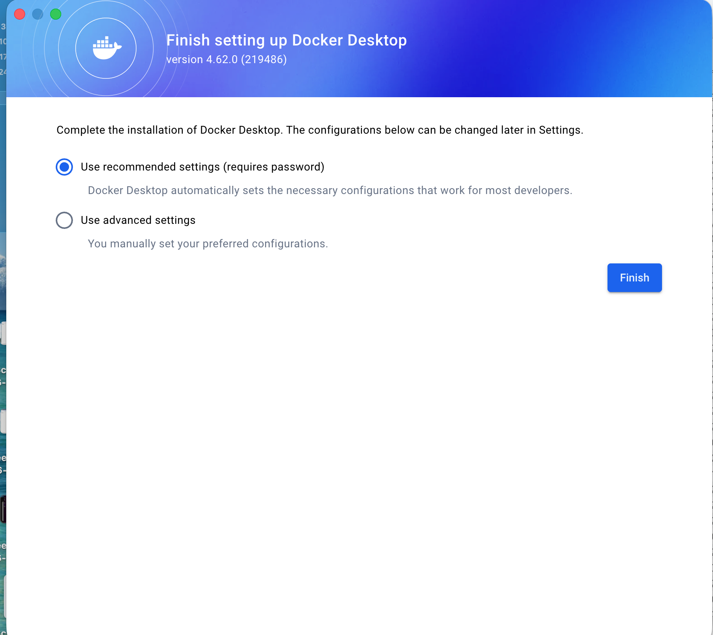
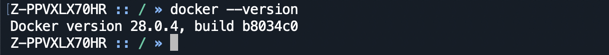
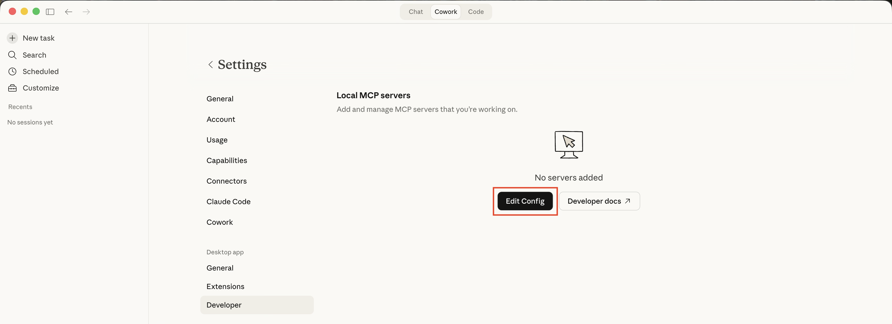
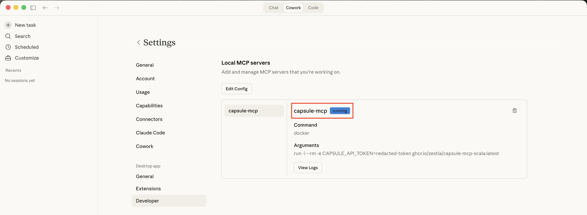
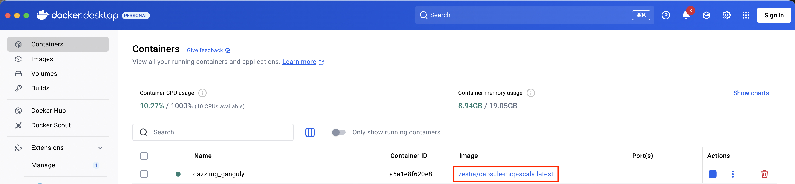

# Capsule MCP Server

MCP server that connects to your Capsule CRM data. You can get started with the server and use it with your favourite AI assistant. 

Follow the instructions below to get started.

## Prerequisites

You will need an AI assistant installed that supports **local** MCP servers. Some popular options:

- **[Claude Desktop](https://claude.com/download)** - Anthropic's desktop app
- **[Cursor](https://www.cursor.com/)** - AI code editor

---

## 1. Install Docker
The Capsule MCP Server runs inside [Docker](https://www.docker.com/).
Docker is a free tool that packages software code along with all its necessary settings and dependencies into a single, portable "container".
It is not owned or associated with Capsule but is necessary to run the Capsule MCP server on your computer.

### Option 1: Docker Desktop (recommended for most users)

1. Go to [https://www.docker.com/products/docker-desktop](https://www.docker.com/products/docker-desktop/)
2. Click **Download Docker Desktop**, selecting your Operating System
3. Run the installer and follow the prompts
4. If prompted for configuration settings, select **Use recommended settings**:

5. Restart your computer if prompted
6. Launch Docker Desktop

### Option 2: CLI only (for developers)

Follow the [official installation guide](https://docs.docker.com/engine/install/) for your specific distribution.

---

## 2. Verify your Docker installation

Once Docker is installed **and the Docker app is open**, confirm the installation by opening the **Terminal** app (macOS) or **Command Prompt** (Windows) and entering:

```
docker --version
```

It should print a version number, similar to below:



---

## 3. Locate your AI assistant config file
Locate the configuration file for your chosen AI assistant:

### Claude Desktop
1. Open Claude Desktop
2. Open the `Settings` menu:
    - macOS - `Claude` → `Settings`
    - Windows - `File` → `Settings`
3. Select `Developer`, and under `Local MCP Servers` select `Edit Config`
  
4. This will open a Finder/File Explorer window with the `claude_desktop_config.json` file selected
5. Open the file:
    - macOS - Right-click and `Open with` → `TextEdit`
    - Windows - Right-click and `Open with` → `Notepad`

### Cursor
See [configuration locations](https://cursor.com/docs/context/mcp#configuration-locations) to locate the config file.

---

## 4. Copy MCP server config
1. **Exit your AI Assistant app (Claude, Cursor, etc.)** - this is to prevent any issues while editing and saving the file
2. Copy and paste the following into the file (do not save at this point):

```json
{
 "mcpServers": {
   "capsule-mcp": {
     "command": "docker",
     "args": [
       "run",
       "-i",
       "--rm",
       "-e",
       "CAPSULE_API_TOKEN=your-api-token",
       "ghcr.io/zestia/capsule-mcp-scala:latest"
     ]
   }
 }
}
```

---

## 5. Generate an API key
1. In your Capsule account, navigate to: `My Preferences` → `API Authentication Tokens` → `Generate New API Token`
     - **Description:** Capsule MCP Server
     - **Scope of this token:** Select `Read information from your Capsule account` only
2. Copy the generated token
3. In your open `claude_desktop_config.json` file, replace `your-api-token` with the copied token. Do not delete the `CAPSULE_API_TOKEN=` prefix.
4. **Save** the file

---

## 6. Test the connection

@@@ note
Each time you wish to use your MCP server, you should launch Docker and ensure it is running **before opening your AI Assistant (Claude, Cursor, etc.)**.
The Docker app must be running for the MCP server to start and run.
@@@

1. Launch your AI assistant
2. You should now see a new `capsule-mcp` server running in the list of available MCP servers in Settings. For example, in Claude Desktop:
  
3. You should also see a "container" running in the Docker app:
  
4. Try asking a basic question about your Capsule account to test the connection, for example: `How many contacts do I have in Capsule?`
5. If you are having any issues or seeing errors, please refer to the [troubleshooting guide](troubleshooting.html).

@@@ index
* [Available Tools](available-tools.md)
* [Troubleshooting](troubleshooting.md)
@@@
