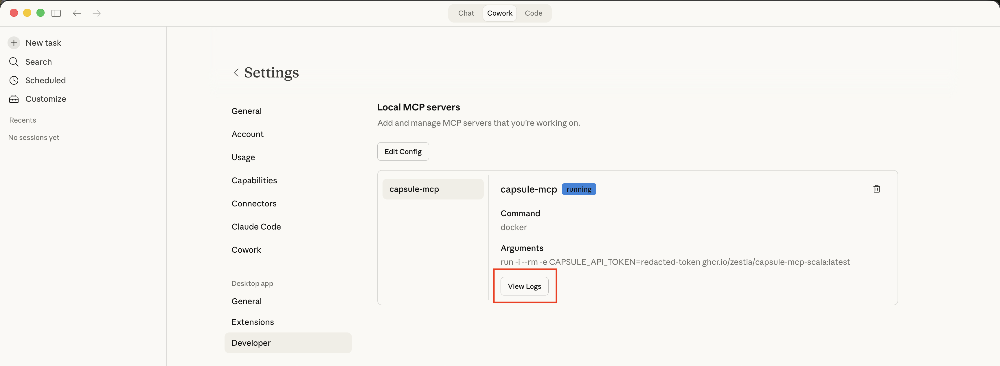

# Troubleshooting
If your AI assistant is having trouble connecting to the MCP server, ensure the following:

* The Docker app is already running **before** starting your AI assistant. Docker must be running for the MCP server to start and during the whole time you wish to use the Capsule MCP server
* Your Capsule API token is valid
* Your config file is formatted correctly - see example [config file](index.html#4-copy-mcp-server-config)

If you're still having issues, please let us know with the following information:

1. Your Operating System & what AI assistant you are using
2. Screenshots / the exact error message you are seeing
3. If some questions about your Capsule account succeed and others do not - i.e. your AI assistant is connecting to the MCP server, but you're having an issue with a specific question/prompt
4. Locate and send us the logs for the MCP server:
    * **Claude Desktop**
        * In `Settings` → `Developer` → `Local MCP Servers`, you should see `capsule-mcp`
        * Select `View Logs` to view the file
          
    * **Cursor**
        * In `Settings` → `Cursor Settings` → `Tools & MCP`, under `Installed MCP Servers` find `capsule-mcp`
        * Select `Show output`
5. Anything else you think might be helpful